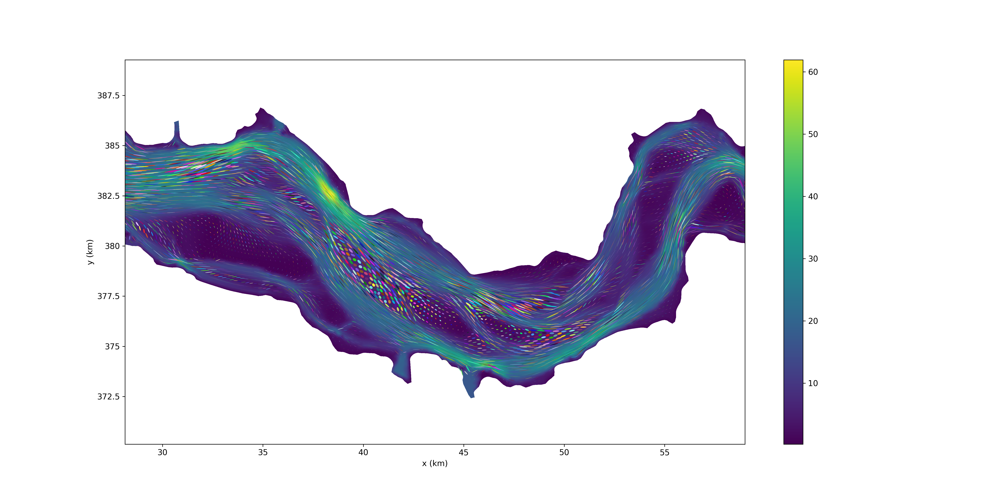

# iFlow3D
Three dimensional idealised model for estuarine dynamics.

Example of tidal ellipses in the Scheldt estuary:

This is a beta version of the code. 
The final model will be merged with the main iFlow code: https://github.com/YoeriDijkstra/iFlow when it is ready.
